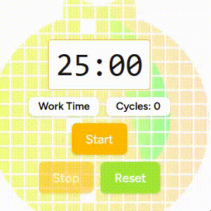
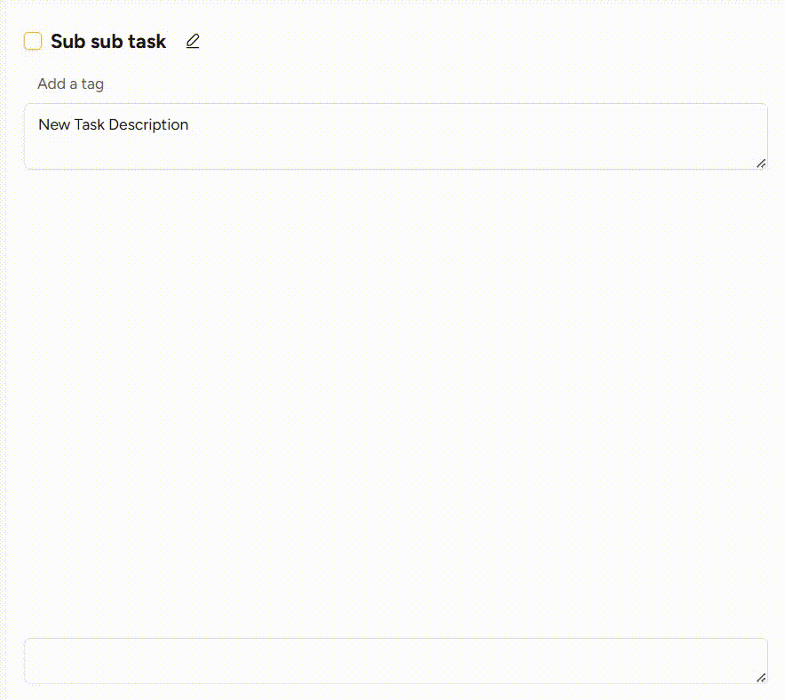
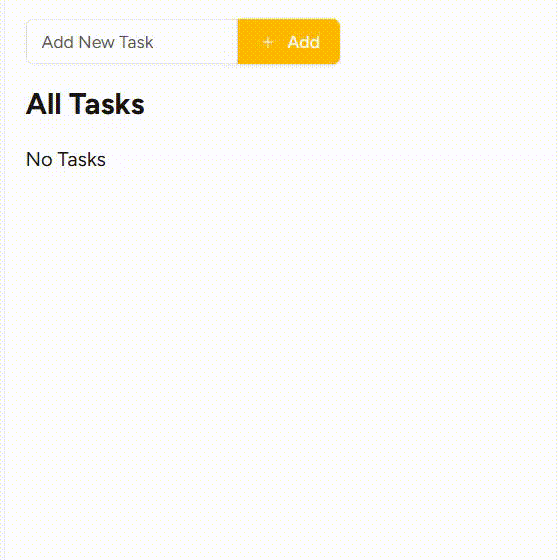
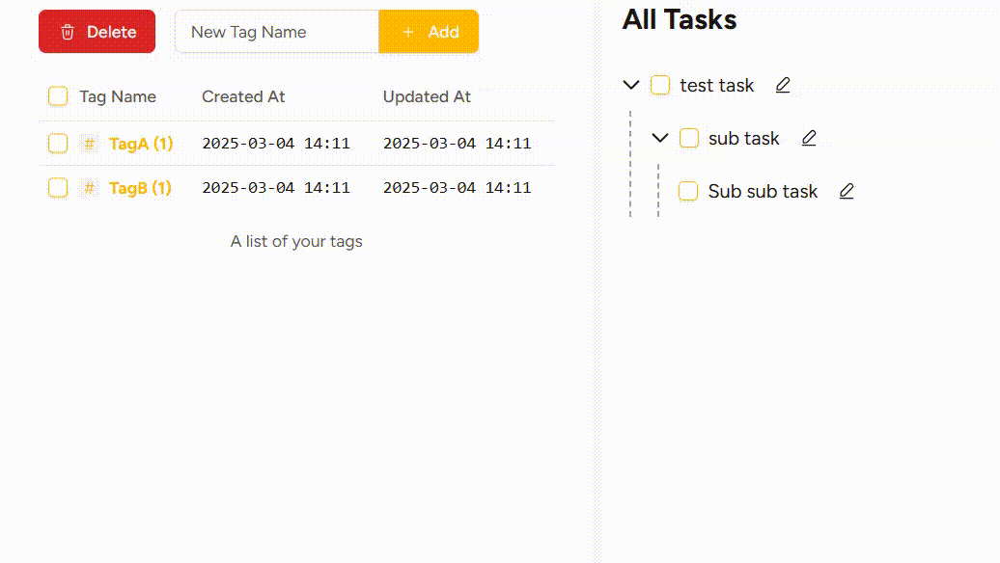

# Decopon - The Task Manager for ADHD

    
    
    
    

**Other language**

[JP](documents/README.jp.md)

**Naming**

*Deco*mpose Task and *Po*modoro and get it do*n*e.

**Overview**

This software is self-hostable task manager. Originally conceived as a countermeasure against procrastination for individuals with ADHD. Currently in a pre-alpha stage and not yet ready for public use. If you're interested, please star this repository.

**Tech Stack**

*This system is currently composed of a Rust (Axum) backend and React.*

## Features

- **Focus Sessions with Pomodoro Technique**: A timer that breaks your work into 25-minute intervals followed by a 5-minute break.
- **Organize Tasks with Nested Lists**: Organize your tasks in a list format for easy management.
- **Easy Logging**: Add tags to each task to categorize them easily.
- **Search Functionality**: Quickly find tasks using keywords or tags.

## 🎯 Theoretical Background: Challenges Decopon Aims to Solve

People with ADHD often struggle with **procrastination and difficulty completing tasks**. Research suggests that these difficulties can be attributed to three major factors:

1. **Challenges with self-monitoring**
2. **Limited working memory**
3. **Dopamine deficiency, leading to a lack of motivation ("task inertia")**

Decopon is designed to address these issues through targeted features.

---

### **1. Helping with Self-Monitoring**
One of the core challenges for people with ADHD is keeping track of **progress and performance**. To address this, Decopon provides **automatic behavior tracking**.

- **Records when you start and stop a focus session**
- **Logs completed tasks automatically**
- **Tracks the number of focus sessions per week**

With this data, you can analyze your performance patterns:  
*"When am I most productive?"* / *"What situations lead to procrastination?"*  
Over time, this self-awareness can help you understand when and why you tend to procrastinate.

**→ Gain insights into your work habits and procrastination triggers.**

---

### **2. Managing Limited Working Memory**
People with ADHD often struggle with **holding multiple pieces of information in their minds at once**. Decopon provides a structured way to break down tasks.

- **Subtasks can be broken down into infinite layers** (technically limited by system performance, but practically sufficient)
- **Chat-style notes allow you to offload temporary information**
- **Break big tasks into smaller, manageable steps**

Instead of trying to juggle everything at once, Decopon encourages you to:
1. **Forget large tasks and focus only on the next step.**
2. **Write down extra details and let go of unnecessary mental clutter.**

**→ Reduce cognitive overload and stay focused on the task at hand.**

---

### **3. Overcoming Dopamine Deficiency ("Task Inertia")**
A lack of dopamine makes it difficult for people with ADHD to **initiate and sustain effort on tasks**.  
To counter this, Decopon integrates **Pomodoro-style focus sessions** to create a **game-like challenge**.

- **Time constraints create a sense of urgency, helping boost motivation**
- **Tracking how many sessions you complete turns productivity into a "hunting game"**
- **Tedious obligations start to feel more like a "work game"**

Dopamine is known to be released when pursuing a goal.  
By structuring work as **a sequence of small "hunts" (short focus sessions)**, Decopon leverages this **natural drive** to improve engagement.

**→ Convert boring tasks into a structured game-like challenge.**

---

## **Summary**
Decopon addresses common ADHD productivity struggles through three core mechanisms:

| Challenge                                 | How Decopon Helps                                  |
| ----------------------------------------- | -------------------------------------------------- |
| **Difficulty with self-monitoring**       | Tracks behavior and progress automatically         |
| **Limited working memory**                | Infinite subtask nesting & chat-style notes        |
| **Lack of motivation (dopamine deficit)** | Pomodoro sessions turn tasks into a "hunting game" |

I hope this tool helps make task management easier and more engaging for you. 🚀

## Development & Setup

Decopon can be developed in two main configuration modes:

### 1. Tauri App (Desktop / Android) + SQLite (Recommended for mobile/local)
This mode runs the Rust backend within the Tauri application and uses a local SQLite database, removing the need for external database services.

**Setup Instructions:**
1. Copy the environment templates:
   - For Windows: `cp .env.windows.example .env.windows`
   - For Android: `cp .env.android.example .env.android`
     - *Important*: The `.env.android` file is mandatory for mobile builds. Without it, Vite falls back to the default `.env` and enforces an HTTP transport (`localhost:3000`), which causes network errors in the Android emulator.
2. Ensure you have the [Tauri setup requirements](https://tauri.app/v1/guides/getting-started/prerequisites) installed (Rust, Node.js, Android Studio with NDK).
3. Start the dev server:
   - Windows: `pnpm dev:windows`
   - Android: `pnpm dev:android`

### 2. Web App + PostgreSQL (For cloud/multi-user deployment)
This mode runs a standalone Axum web server backed by PostgreSQL, suitable for web browsers.

**Setup Instructions:**
1. Ensure PostgreSQL is running.
2. Copy the web environment template: `cp .env.web.example .env.web`
3. Initialize the database schema: `pnpm db:migrate`
4. Start the fullstack web development environment: `pnpm dev:web`

## Roadmap

- Mobile (Pertially done by responsive web and tauri)
- Endless Dog-fooding and bugfix (Current)
- Darktheme
- Native Notification
- Selfhost Guide
...and so on

## ☕ Support the Project

Living with ADHD makes it challenging for me to see things through to the end.  
That's why I started Decopon—not only as a tool to help myself stay organized, but also in the hope that it might support others facing similar struggles.

If you find Decopon helpful and want to support its development, you can do so here:

[☕ Buy me a coffee!](https://buymeacoffee.com/kawadumax)

Your support helps keep this project alive and allows me to continue improving it.  
Every little bit makes a difference—thank you! 💖
