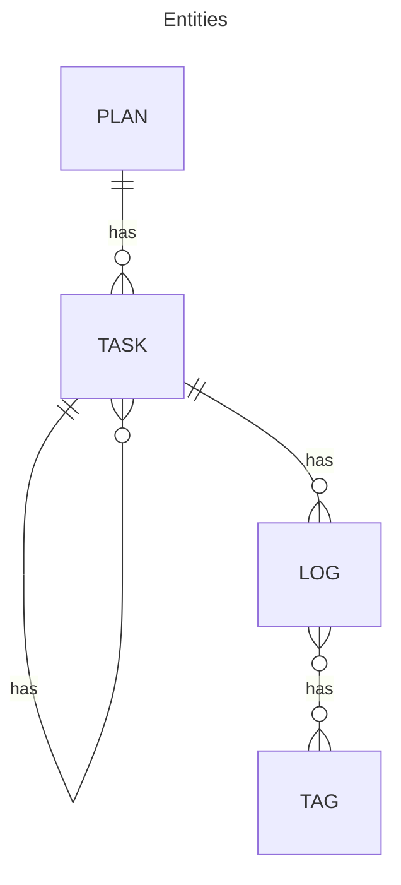

# GUI の設計

## エンティティ抽出

- User
- Task
- Plan
- Log
- Tag
- TimeEntry

### Figures



```mermaid
---
title: Views
---
classDiagram

```

## ビューのイメージ

タスクビューでは、ツリービューと詳細ビューがある？
ツリービューは分解するためのビュー。詳細ビューはログを取るためのビュー。
実行コンテクストも詳細ビュー。
