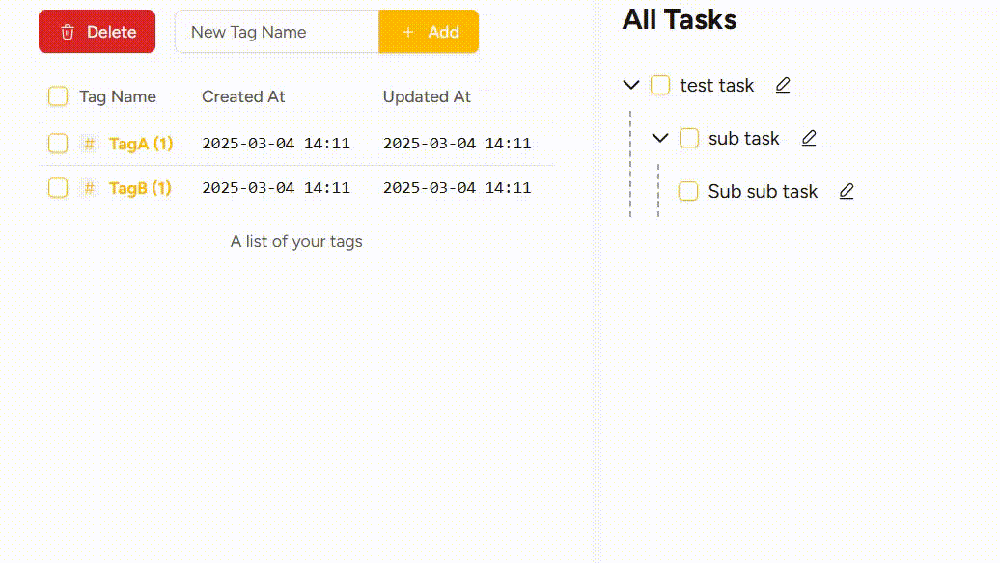

# Decopon - ADHDのためのタスクマネージャー

    
    
    
    
 

**翻訳**

[EN](../README.md)

**命名**

*Deco*mpose Task and *Po*modoro and get it do*n*e.

**概要**

このソフトウェアは、セルフホスト可能なタスクマネージャーです。元々はADHDの方の先延ばし対策として構想されました。現在プレアルファ段階であり、まだ一般利用の準備は整っていません。もしご興味があれば、このリポジトリにスターをお願いします。

**技術スタック**

*このシステムは現在Rust（Axum）バックエンドとReactで構成されています。*

## 開発者向けドキュメント

- [IPC サービス層アーキテクチャと運用ガイド](ipc-architecture-guide.md)
- [Windows IPC 移行検証レポート](windows-ipc-migration.md)
- [ADR: IPC/HTTP 共通 API クライアントの設計](ADR-frontend-api-transport.md)

## 機能

- **ポモドーロテクニックを使った集中セッション**: 25分間の作業と5分間の休憩を組み合わせたタイマー機能
- **ネストしたリストでタスクを整理**: 管理しやすいリスト形式でタスクを整理
- **簡単ログ機能**: 各タスクにタグを追加して簡単に分類
- **検索機能**: キーワードやタグを使って素早くタスクを検索

## 🎯 理論的背景：Decoponが解決を目指す課題

ADHDの方は、しばしば**先延ばしやタスクの完了困難**に悩まされます。研究によると、これらの困難は3つの主要な要因に起因するとされています：

1. **自己モニタリングの困難**
2. **限られたワーキングメモリ**
3. **ドーパミン不足によるモチベーション欠如**

Decoponは、これらの問題に対処するために設計されています。

---

### **1. 自己モニタリングの支援**
ADHDの方にとって主要な課題の一つは、**進捗とパフォーマンスの追跡**です。これに対処するため、Decoponは**自動的な行動追跡**を提供します。

- **集中セッションの開始と終了を記録**
- **完了したタスクを自動的にログ記録**
- **週あたりの集中セッション数を追跡**

このデータを使って、パフォーマンスパターンを分析できます：  
*「いつが最も生産的か？」* / *「どのような状況で先延ばしが発生するか？」*  
時間が経つにつれて、この自己認識により、いつなぜ先延ばしをしがちなのかを理解できるようになります。

**→ 作業習慣と先延ばしの引き金に関する洞察を得る。**

---

### **2. 限られたワーキングメモリの管理**
ADHDの方はしばしば**複数の情報を同時に頭の中に保持する**ことに困難を抱えます。Decoponは、タスクを構造化して分解する方法を提供します。

- **サブタスクを無限の層に分解可能**（技術的にはシステムパフォーマンスにより制限されますが、実用的には十分）
- **チャット形式のメモで一時的な情報を外部化**
- **大きなタスクを小さく管理可能なステップに分割**

すべてを同時に処理しようとする代わりに、Decoponは次のことを推奨します：
1. **大きなタスクを忘れて、次のステップにのみ集中する。**
2. **詳細を書き留めて、不要な精神的な負担を手放す。**

**→ 認知的負荷を軽減し、手元のタスクに集中し続ける。**

---

### **3. ドーパミン不足の克服（「タスク慣性」）**
ドーパミン不足により、ADHDの方は**タスクの開始と継続的な努力**が困難になります。  
これに対処するため、Decoponは**ポモドーロ式集中セッション**を統合して**ゲームのような挑戦**を作り出します。

- **時間制約が緊急感を生み、モチベーション向上を支援**
- **完了したセッション数の追跡により、生産性を「狩猟ゲーム」に変換**
- **退屈な義務が「作業ゲーム」のように感じられるようになる**

ドーパミンは目標を追求する際に放出されることが知られています。  
作業を**小さな「狩り」（短い集中セッション）の連続**として構造化することで、Decoponはこの**自然な衝動**を活用してエンゲージメントを向上させます。

**→ 退屈なタスクを構造化されたゲームのような挑戦に変換する。**

---

## **まとめ**
Decoponは、3つの核となるメカニズムを通じて、ADHDの一般的な生産性の困難に対処します：

| 課題                                     | Decoponの支援方法                                  |
| ---------------------------------------- | -------------------------------------------------- |
| **自己モニタリングの困難**               | 行動と進捗を自動的に追跡                           |
| **限られたワーキングメモリ**             | 無限サブタスクネスト＆チャット形式メモ             |
| **モチベーション不足（ドーパミン不足）** | ポモドーロセッションでタスクを「狩猟ゲーム」に変換 |

このツールがタスク管理をより簡単で魅力的にしてくれることを願っています。🚀

## ロードマップ

- モバイル対応（レスポンシブウェブとTauriにより一部完了）
- 継続的な実地試験とバグ修正（現在）
- ダークテーマ
- ネイティブ通知
- セルフホストガイド
...その他

## ☕ プロジェクトの支援

どうも、作者の kawadumax です。プロジェクトの支援のご挨拶の前に少し自己紹介をお許しください。
自分にとっては、物事を最後までやり遂げるということが本当に困難でした。いえ、今も変わらず困難です。

自分は大学生だったころに ADHD と診断され、以降、10年以上この障害と向き合いながら生活してきました。
集中力不足、無気力、先延ばし、そのくせ頭の中は常に忙しく、何かをやらねばならないという衝動で満ちており、
周囲の人間がさらりと達成していく毎日の仕事や課題を横目に、自分のできなさに絶望していました。

ですが、自身の発達障害について学んでいく中で、色々な心理ハックや生活の工夫を取り入れて、
少しずつコントロール出来てきたように思います。
Decopon はそれらの知見を、自分だけのためのツールとしてではなく、
似たような困難に直面している他の人々を支援する希望も込めて作り始めました。

もしDecoponが役に立つと感じ、その開発を支援したいと思われる場合、こちらでサポートしていただけます：

[☕Buy me a coffee](https://buymeacoffee.com/kawadumax)
